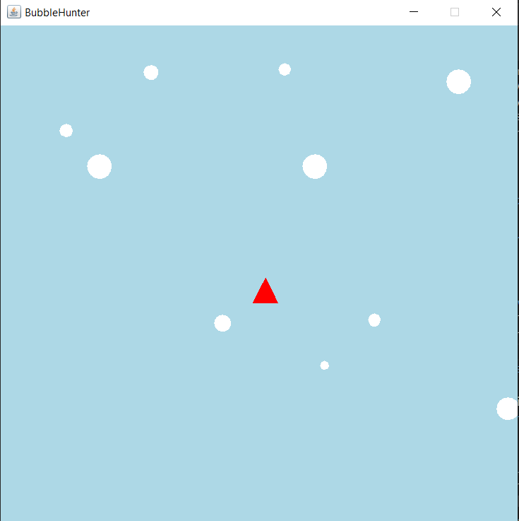

### Запуск

`Ctrl` + `F5` 

Десять пузырей плывут вверх, при достижении верхней границы экрана пузыри полностью скрываются, после чего перемещаются под нижнюю границу экрана равную высоте своего диаметра.

